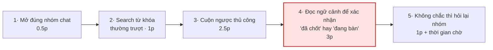
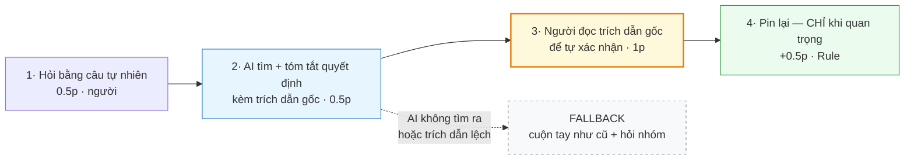
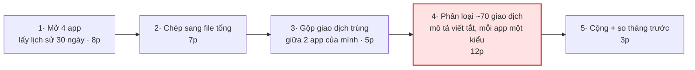
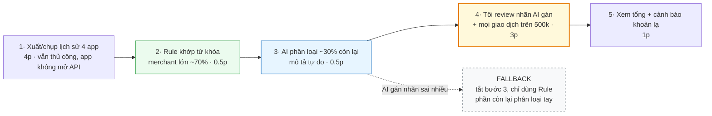
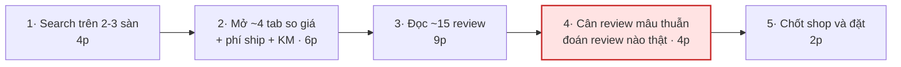
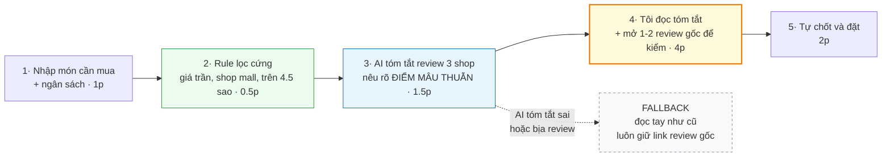

# 01 — Individual Problem Scan

> Điền theo Phase 1 + Phase 2 trong `01-worksheet.md`. Tự scan trước, dùng AI sau để phản biện. Không copy ví dụ Weekly Report.

## Thông tin cá nhân

- Họ và tên: Nguyễn Vũ Huy
- Mã học viên: 2A202602662
- Vai trò / bối cảnh: Thành viên dự án thực tế tại một startup lớn, đồng thời là học viên K4A AI20k. Lăng kính scan: đời sống cá nhân + các app đang dùng hằng ngày.
- Công việc hằng tuần (3-5 gạch đầu dòng để soi problem):
  - Làm task trong dự án thực tế, trao đổi và nhận việc chủ yếu qua nhóm chat
  - Học và nộp bài lab AI20k qua GitHub, theo dõi thông báo trên Discord
  - Quản lý chi tiêu cá nhân qua nhiều ví điện tử và app ngân hàng
  - Mua sắm / đặt dịch vụ online vài lần mỗi tháng
  - Là người được người thân hỏi lại mỗi khi vướng thao tác trên app

> **Ghi chú về số liệu:** toàn bộ số trong file này là **ước lượng từ quan sát của bản thân**, chưa bấm giờ có hệ thống. Ba số dùng làm baseline cần bấm giờ xác nhận đã được liệt kê ở cuối Phase 1.

---

## Phase 1 — Scan 5+ problems (tối thiểu 5, khuyến khích 8-10)

**Cách điền:** mỗi dòng = việc gì + ai chịu + đo bằng gì. Cột `Dấu hiệu thật` bắt buộc có số: mất bao lâu (bấm giờ mấy lần), mấy lần/tuần, bao nhiêu người gặp, log/ticket/quote nào.

| # | Lăng kính (Lặp lại / Tốn thời gian / AI có thể tốt hơn / Pain từ người khác) | Problem quan sát được | Ai chịu ảnh hưởng? | Dấu hiệu thật (số + bằng chứng) |
|---|---|---|---|---|
| 1 | Lặp lại | Cuối tháng phải tự gom giao dịch từ nhiều ví điện tử + app ngân hàng + thẻ mới biết thực tế đã tiêu bao nhiêu và tiêu vào đâu | Bản thân | 4 app tài chính đang dùng song song; ~70 giao dịch/tháng; ~35 phút/lần gom, 1 lần/tháng *(ước lượng)*. Bằng chứng: lịch sử giao dịch 30 ngày trong từng app |
| 2 | Lặp lại | Nhập lại cùng một bộ thông tin cá nhân (họ tên, CCCD, địa chỉ, số tài khoản) mỗi lần đăng ký dịch vụ, đặt hàng hoặc khai form | Bản thân | ~6 form/tháng × 3-5 phút = ~25 phút/tháng *(ước lượng)*. Bằng chứng: mail "xác nhận đăng ký / đơn hàng" trong hộp thư 30 ngày |
| 3 | Lặp lại | Các khoản trừ tiền định kỳ (subscription app, cloud, hóa đơn dịch vụ) tự động gia hạn, không có chỗ nào nhìn thấy toàn bộ cùng lúc | Bản thân | ~7 gói đang active, tổng ~450k/tháng, trong đó 2 gói không nhớ đã đăng ký *(ước lượng)*. Bằng chứng: mục Subscriptions trên máy + sao kê thẻ 3 tháng |
| 4 | Tốn thời gian — *tìm kiếm* | Cuộn ngược nhóm chat (Zalo / Discord / Slack) để tìm lại một quyết định, link hoặc con số đã chốt trước đó, vì search từ khóa không khớp cách mọi người diễn đạt | Bản thân + các thành viên khác trong nhóm chat | ~12 nhóm chat active; ~8 phút/lần tìm; ~3 lần/tuần → ~24 phút/tuần *(ước lượng)*. Bằng chứng: các lần phải hỏi lại trong nhóm vì không tự tìm ra |
| 5 | Tốn thời gian — *chờ đợi* | Chờ phản hồi CSKH / duyệt đơn / hoàn tiền và phải chủ động vào app kiểm tra nhiều lần vì không có thông báo tiến độ | Bản thân | Ca hoàn tiền gần nhất: 5 ngày từ lúc gửi tới lúc xong, tự vào check ~6 lần *(ước lượng)*. Bằng chứng: lịch sử chat CSKH trong app |
| 6 | Tốn thời gian — *định dạng* | Chuyển dữ liệu giữa các app bằng tay: chụp màn hình hóa đơn/bảng rồi gõ lại vào Sheet/Note, hoặc copy từ PDF ra form | Bản thân | ~18 ảnh dạng hóa đơn/bảng trong album Screenshots 30 ngày; ~6 phút/lần nhập lại *(ước lượng)* |
| 7 | AI có thể tốt hơn | Trước khi mua/đặt phải mở 2-3 sàn hoặc app cùng lúc, tự nối giá + phí ship + review + khuyến mãi mới ra được quyết định | Bản thân | 3 app + ~4 tab mở cùng lúc; đọc ~15 review; ~25 phút cho 1 quyết định; ~3 quyết định/tháng → ~75 phút/tháng *(ước lượng)* |
| 8 | AI có thể tốt hơn | Phải đọc hết tài liệu dài (điều khoản, hợp đồng, chính sách hoàn tiền, hướng dẫn thủ tục) chỉ để rút ra 1-2 điều liên quan tới mình | Bản thân | Tài liệu gần nhất ~14 trang, đọc ~30 phút, thực tế chỉ cần 2 điều khoản *(ước lượng)* |
| 9 | Pain từ người khác | Người thân/bạn bè hỏi lặp lại cùng một hướng dẫn thao tác app (chuyển khoản, quét QR, xác thực sinh trắc học, cài app) | 3 người thân ít rành công nghệ + bản thân là người bị hỏi | ~5 lần/tháng, từ 3 người khác nhau, mỗi lần ~10 phút hướng dẫn *(ước lượng)*. Bằng chứng: lịch sử chat 2 tháng gần nhất |
| 10 | Pain từ người khác | Trong nhóm chat/dự án, cùng một câu hỏi bị hỏi lại nhiều lần bởi nhiều người ("link ở đâu", "deadline hôm nào", "ai phụ trách") | Cả nhóm, đặc biệt người mới vào | ~11 lần hỏi lặp trong 2 tháng, từ ~6 người khác nhau *(ước lượng)*. Bằng chứng: search từ khóa "link", "deadline", "ở đâu" trong nhóm |

**Phân bổ lăng kính:** Lặp lại 3 · Tốn thời gian 3 (đủ cả *tìm kiếm / chờ đợi / định dạng*) · AI có thể tốt hơn 2 · Pain từ người khác 2 → **4/4 lăng kính**, 10 dòng.

### Ba số cần bấm giờ xác nhận trước khi dùng làm baseline

| Dòng | Số cần chốt lại | Cách đo | Vì sao quan trọng |
|---|---|---|---|
| 4 | ~8 phút/lần tìm ngược chat | Bấm giờ đúng 1 lần tìm thật | Baseline của Card #1 — card tôi định pitch |
| 1 | ~35 phút/lần gom chi tiêu | Bấm giờ lần gom cuối tháng này | Baseline của Card #2 |
| 7 | ~25 phút/quyết định mua | Bấm giờ lần mua tiếp theo | Baseline của Card #3 |

> Gợi ý tự soi: tuần trước mất nhiều thời gian nhất vào việc gì? Việc gì hay trì hoãn? Người khác hay hỏi lại câu gì? Workflow nào ai cũng biết là chậm?

**AI đã dùng ở Phase 1 (nếu có):**
- Prompt đã hỏi: nhờ AI gợi ý problem theo 4 lăng kính trong bối cảnh đời sống cá nhân / app đang dùng, và yêu cầu chỉ ra **chỗ lấy số thật** thay vì đưa số sẵn.
- Ý dùng được: subscription tự gia hạn không có chỗ xem tổng (dòng 3) và câu hỏi lặp lại trong nhóm chat (dòng 10) — hai ý này tôi chưa nghĩ tới khi tự scan.
- Ý bỏ vì không phải pain thật: AI gợi ý "quản lý hồ sơ sức khỏe rải rác" và "lên kế hoạch du lịch nhóm" — tôi bỏ vì tần suất của tôi quá thấp, không phải pain lặp lại.
- Điểm tôi tự sửa: AI ban đầu định lấy thống kê nước ngoài (khảo sát subscription của Mỹ) làm `Dấu hiệu thật`. Tôi bỏ, vì đó không phải quan sát của tôi và không trả lời được câu "bạn đo thế nào". Số liệu đó để dành cho phần research, kèm ghi chú rõ là dữ liệu thị trường Mỹ.

**Self-check Phase 1:**
- [x] Đủ 5+ dòng, mỗi dòng có actor + số đo cụ thể
- [x] Dùng ít nhất 3/4 lăng kính *(đạt 4/4)*
- [x] Không có dòng chung chung kiểu "mất nhiều thời gian"
- [x] Mỗi dòng nói rõ số lấy từ đâu; số chưa bấm giờ đã gắn nhãn *(ước lượng)*

---

## Phase 2 — Top 3 Problem Cards

### 2.1. Chọn top 3

Giữ bài nào: actor cụ thể, workflow vẽ được 3-7 bước, bottleneck ở 1 bước, impact đo được. Loại bài quá rộng.

Tiêu chí xếp hạng: **tần suất × thời gian mất mỗi lần × số người cùng chịu**.

| Rank | Problem (copy từ bảng scan) | Vì sao chọn (2-3 ý) | Điều còn chưa chắc |
|---|---|---|---|
| 1 | Dòng 4 + 10 — Tìm lại một quyết định/link/con số đã chốt trong nhóm chat | Tần suất cao nhất (~3 lần/tuần); là bài duy nhất **đo được cả hai phía**: thời gian của tôi (~24 phút/tuần) và số câu hỏi lặp của nhóm (~11 lần/2 tháng); có non-AI alternative rõ (pin message + file quyết định) nên so sánh Rule/Workflow/Agent được | Chưa rõ bao nhiêu phần trăm số lần tìm là do search dở, bao nhiêu là do nhóm chốt đi chốt lại nhiều lần. Nếu là vế sau thì đây là vấn đề quy trình, không phải vấn đề công cụ |
| 2 | Dòng 1 + 3 — Không có bức tranh chi tiêu hợp nhất qua nhiều ví/ngân hàng/subscription | Tốn nhiều thời gian nhất mỗi lần (~35 phút); hậu quả đo được bằng tiền (2 gói subscription không nhớ đã đăng ký vẫn đang bị trừ); workflow 5 bước vẽ được rõ | Chưa chắc app ngân hàng có cho xuất lịch sử giao dịch dạng file không. Nếu không thì bước lấy dữ liệu còn tốn hơn cả bước phân loại, và AI bị đặt sai chỗ |
| 3 | Dòng 7 — Phải tự nối giá + phí ship + review từ nhiều nguồn trước khi quyết định mua | Đúng dạng việc AI mạnh (đọc hiểu ngữ cảnh, tổng hợp đa nguồn); ~75 phút/tháng; có non-AI alternative rõ (checklist tiêu chí cố định) | Chưa chắc 25 phút đó là "lãng phí" hay là phần tôi thực sự muốn tự cân nhắc. Nếu là vế sau thì rút ngắn chưa chắc đã là cải thiện |

**Vì sao loại 7 dòng còn lại:** dòng 2 và 6 có tần suất vừa phải nhưng đã có giải pháp phổ biến sẵn (autofill, OCR) nên không đáng đào sâu trong lab; dòng 5 bước nghẽn nằm ở phía nhà cung cấp, tôi không tác động được; dòng 8 tần suất quá thấp; dòng 9 impact nhỏ và actor hẹp.

### 2.2. Problem Cards chi tiết (lặp lại cho cả 3 cards)

---

#### Problem Card #1 — Tìm lại quyết định đã chốt trong nhóm chat

```text
Problem 1 câu:
Mỗi khi cần dùng lại một quyết định / link / con số đã chốt trong nhóm chat, tôi phải
cuộn ngược khoảng 8 phút vì search từ khóa không khớp cách mọi người diễn đạt, và vẫn
phải đọc thêm ngữ cảnh xung quanh mới dám chắc đó là chốt cuối chứ không phải đang bàn.

Actor:
Thành viên nhóm dự án / CLB dùng nhóm chat làm nơi lưu quyết định (tôi + khoảng 6 người
trong nhóm). Nặng nhất với người mới vào, vì họ không có ký ức về cuộc thảo luận.

Thời điểm / bối cảnh:
Khi bắt đầu một task phụ thuộc vào quyết định cũ, hoặc khi có người hỏi lại trong nhóm.

Current workflow 3-7 bước:
1. Nhớ mang máng là đã chốt rồi, mở đúng nhóm chat
2. Search 1-2 từ khóa mình đoán, thường không ra vì mọi người viết tắt hoặc diễn đạt khác
3. Chuyển sang cuộn ngược thủ công quanh khoảng thời gian đoán là đã chốt
4. Tìm thấy đoạn liên quan, nhưng phải đọc thêm 20-30 tin xung quanh để biết đây là
   chốt cuối hay chỉ là một ý đang bàn         <-- bottleneck
5. Nếu vẫn không chắc thì hỏi lại trong nhóm và chờ người khác trả lời

Bottleneck:
Bước 4 - đọc lại ngữ cảnh để phân biệt "đã chốt" với "đang bàn". Search chỉ trả về tin
nhắn rời, không trả về kết luận.

Impact:
Khoảng 8 phút/lần x khoảng 3 lần/tuần = khoảng 24 phút/tuần cho riêng tôi.
Phía nhóm: khoảng 11 lần hỏi lặp trong 2 tháng từ khoảng 6 người, mỗi lần còn kéo thêm
1-2 người dừng việc để trả lời. (ước lượng)

Success metric:
- Thời gian tìm lại 1 quyết định: từ ~8 phút xuống dưới 2 phút, đo bằng bấm giờ 5 lần tìm thật
- Số câu hỏi lặp trong nhóm: từ ~5.5 lần/tháng xuống dưới 2 lần/tháng, đo bằng search từ khóa

Non-AI alternative:
Quy ước nhóm: mỗi khi chốt thì pin message, cuối buổi cập nhật một file "Quyết định" theo
mẫu (ngày / nội dung chốt / ai chốt / link). Đây là process fix thuần, không cần AI.

AI hypothesis:
AI đọc được ngữ cảnh hội thoại nên có thể phân biệt "chốt cuối" với "đang bàn" - đúng chỗ
mà search từ khóa và pin thủ công đều hụt. AI trả lời kèm trích dẫn tin nhắn gốc để người
dùng tự kiểm.

Quick gut:
[ ] No AI / process fix
[ ] Rule
[x] Workflow
[ ] Agent
[ ] Chưa biết
```

**Draft workflow Card #1** (ASCII / Mermaid / ảnh đính kèm):

```text
CURRENT STATE — khoảng 8 phút/lần

[1 Mở đúng nhóm: 0.5p] → [2 Search từ khóa, thường trượt: 1p] → [3 Cuộn ngược thủ công: 2.5p]
→ [4 Đọc ngữ cảnh để xác nhận chốt cuối: 3p]   <-- bottleneck
→ [5 Không chắc thì hỏi lại nhóm và chờ: 1p + thời gian chờ]

FUTURE STATE — khoảng 2 phút cho một lần tra

[1 Hỏi bằng câu tự nhiên: 0.5p]
→ [2 AI tìm và tóm tắt quyết định, kèm trích dẫn tin nhắn gốc: 0.5p]
→ [3 Người đọc trích dẫn gốc để tự xác nhận: 1p]   <-- human boundary, không được bỏ bước này
                                                   ---- tổng 1 lần tra = 2p ----
→ [4 Pin lại, CHỈ khi là quyết định quan trọng: +0.5p - Rule, không phải lần nào cũng làm]

Fallback: AI không tìm ra hoặc trích dẫn không khớp → quay về cuộn tay như cũ và hỏi nhóm.
Boundary: AI chỉ tìm và tóm tắt. AI KHÔNG được thay mặt nhóm chốt lại quyết định.
```

**Sơ đồ Card #1 — CURRENT (~8 phút/lần):**



`4·` là bottleneck: search trả về tin nhắn rời, không trả về kết luận.

**Sơ đồ Card #1 — FUTURE (~2 phút cho một lần tra):**



🟦 AI · 🟨 **human boundary** (không được bỏ bước 3) · 🟩 Rule · ⬜ fallback
Boundary: AI chỉ tìm và tóm tắt. AI **không** được thay mặt nhóm chốt lại quyết định.

*Workflow vẽ trực tiếp bằng ASCII + Mermaid ở trên, không tách file ảnh riêng.*

---

#### Problem Card #2 — Không có bức tranh chi tiêu hợp nhất

```text
Problem 1 câu:
Tiền của tôi chảy qua 4 app tài chính khác nhau nên cuối tháng phải ngồi gom tay khoảng
35 phút mới biết đã tiêu bao nhiêu và tiêu vào đâu, dẫn tới có 2 gói subscription bị trừ
tiền nhiều tháng mà tôi không nhớ mình đã đăng ký.

Actor:
Cá nhân đi làm dùng 3-5 app tài chính song song (ví điện tử + app ngân hàng + thẻ).

Thời điểm / bối cảnh:
Cuối tháng, hoặc khi cần cân đối trước một khoản chi lớn.

Current workflow 3-7 bước:
1. Mở lần lượt 4 app, vào lịch sử giao dịch 30 ngày
2. Chụp màn hình hoặc chép tay sang một file tổng
3. Tự gộp các giao dịch trùng (tiền chuyển qua lại giữa 2 app của chính mình)
4. Phân loại từng giao dịch vào nhóm chi tiêu, trong khi mô tả giao dịch viết tắt và
   không thống nhất giữa các app              <-- bottleneck
5. Cộng lại, so với tháng trước, tìm khoản bất thường

Bottleneck:
Bước 4 - phân loại khoảng 70 giao dịch có mô tả tự do, viết tắt, mỗi app một kiểu.

Impact:
Khoảng 35 phút/tháng. Quan trọng hơn thời gian: khoản chi bất thường bị phát hiện muộn
khoảng 3-4 tuần, và 2 gói subscription không nhớ đã đăng ký vẫn đang bị trừ tiền. (ước lượng)

Success metric:
- Thời gian gom + phân loại: từ ~35 phút xuống dưới 10 phút/tháng, đo bằng bấm giờ 2 tháng liên tiếp
- Độ trễ phát hiện khoản bất thường: từ ~30 ngày xuống dưới 7 ngày
- Số giao dịch phải sửa nhãn bằng tay: dưới 10% tổng số giao dịch

Non-AI alternative:
Rule theo từ khóa: mô tả chứa "GRAB" thì vào nhóm Đi lại, chứa "VINMART" thì vào nhóm
Ăn uống, v.v. Giải được phần lớn giao dịch của các merchant lớn, nhưng chịu thua với mô
tả chuyển khoản tự do giữa người với người.

AI hypothesis:
AI đọc hiểu mô tả giao dịch tiếng Việt viết tắt, không dấu, để phân loại đúng phần mà
rule bỏ sót. Đặt AI ở đúng bước 4, không phải toàn bộ workflow.

Quick gut:
[ ] No AI / process fix
[ ] Rule
[x] Workflow
[ ] Agent
[ ] Chưa biết
```

**Draft workflow Card #2:**

```text
CURRENT STATE — khoảng 35 phút/tháng

[1 Mở 4 app, lấy lịch sử: 8p] → [2 Chép sang file tổng: 7p] → [3 Gộp giao dịch trùng: 5p]
→ [4 Phân loại khoảng 70 giao dịch: 12p]   <-- bottleneck
→ [5 Cộng và so sánh tháng trước: 3p]

FUTURE STATE — khoảng 9 phút/tháng

[1 Xuất hoặc chụp lịch sử 4 app: 4p - vẫn thủ công vì app không mở API]
→ [2 Rule khớp từ khóa merchant lớn, phủ khoảng 70% giao dịch: 0.5p - máy]
→ [3 AI phân loại khoảng 30% còn lại có mô tả tự do: 0.5p]
→ [4 Tôi review riêng các nhãn AI gán và mọi giao dịch trên 500k: 3p]   <-- human boundary
→ [5 Xem tổng và cảnh báo khoản lạ: 1p]

Fallback: AI gán nhãn sai nhiều → tắt bước 3, chỉ dùng Rule, phần còn lại tự phân loại tay.
Boundary: AI chỉ gán NHÃN phân loại. AI KHÔNG được đụng vào số tiền và KHÔNG tự kết luận
"khoản này bất thường" thay tôi.
```

**Sơ đồ Card #2 — CURRENT (~35 phút/tháng):**



`4·` là bottleneck: mô tả giao dịch tự do, không thống nhất giữa các app.

**Sơ đồ Card #2 — FUTURE (~9 phút/tháng):**



🟩 Rule · 🟦 AI · 🟨 **human boundary** · ⬜ fallback
Boundary: AI chỉ gán **nhãn phân loại**. AI không đụng vào số tiền và không tự kết luận "khoản này bất thường".

*Workflow vẽ trực tiếp bằng ASCII + Mermaid ở trên, không tách file ảnh riêng.*

---

#### Problem Card #3 — Tự nối nhiều nguồn trước khi quyết định mua

```text
Problem 1 câu:
Trước mỗi quyết định mua online, tôi mở 3 app và khoảng 4 tab, đọc khoảng 15 review để tự
nối giá + phí ship + độ tin cậy của shop, mất khoảng 25 phút cho một món và vẫn thường
thấy không chắc chắn vì các review mâu thuẫn nhau.

Actor:
Người mua online thường xuyên (tôi, khoảng 3 quyết định mua/tháng).

Thời điểm / bối cảnh:
Khi mua món đủ đắt để không muốn chọn bừa, nhưng chưa đủ lớn để đi hỏi người quen.

Current workflow 3-7 bước:
1. Search món cần mua trên 2-3 sàn
2. Mở khoảng 4 tab để so giá, so phí ship, so khuyến mãi
3. Đọc khoảng 15 review của các shop có giá tốt
4. Cân các review mâu thuẫn nhau và đoán review nào là thật    <-- bottleneck
5. Chốt shop và đặt hàng

Bottleneck:
Bước 4 - không có cách nào nhanh để biết review nào đáng tin, phải tự đọc và tự cân.

Impact:
Khoảng 25 phút/lần x khoảng 3 lần/tháng = khoảng 75 phút/tháng. Đôi khi vẫn chọn sai và
phải đổi hoặc trả hàng. (ước lượng)

Success metric:
- Thời gian từ lúc bắt đầu tìm tới lúc đặt: từ ~25 phút xuống dưới 10 phút, đo bằng bấm
  giờ 3 lần mua liên tiếp
- Số lần phải đổi/trả hàng: từ khoảng 1 lần/3 tháng xuống 0, theo dõi trong 3 tháng

Non-AI alternative:
Checklist tiêu chí cố định (giá trần, shop mall, trên 4.5 sao, trên 500 lượt bán) và chỉ
mua ở 2-3 shop đã tin tưởng. Rẻ và không rủi ro, nhưng bỏ lỡ shop mới tốt hơn.

AI hypothesis:
AI tổng hợp review từ nhiều nguồn và chỉ ra chỗ các review mâu thuẫn nhau, thay vì tự kết
luận nên mua cái nào. Người vẫn là người chốt.

Quick gut:
[ ] No AI / process fix
[ ] Rule
[x] Workflow
[ ] Agent
[ ] Chưa biết
```

**Draft workflow Card #3:**

```text
CURRENT STATE — khoảng 25 phút/lần

[1 Search trên 2-3 sàn: 4p] → [2 Mở khoảng 4 tab so giá và phí ship: 6p]
→ [3 Đọc khoảng 15 review: 9p] → [4 Cân review mâu thuẫn, đoán review thật: 4p]   <-- bottleneck
→ [5 Chốt shop và đặt: 2p]

FUTURE STATE — khoảng 9 phút/lần

[1 Nhập món cần mua và ngân sách: 1p]
→ [2 Rule lọc cứng: giá trần, shop mall, trên 4.5 sao: 0.5p - máy]
→ [3 AI tóm tắt review của 3 shop lọt lưới, nêu rõ ĐIỂM MÂU THUẪN giữa các review: 1.5p]
→ [4 Tôi đọc tóm tắt và mở 1-2 review gốc để kiểm: 4p]   <-- human boundary
→ [5 Tự chốt và đặt: 2p]

Fallback: AI tóm tắt sai hoặc bịa review → quay về đọc tay như cũ; luôn giữ link review gốc.
Boundary: AI KHÔNG được xếp hạng "nên mua cái nào" và KHÔNG được tự đặt hàng.
```

**Sơ đồ Card #3 — CURRENT (~25 phút/lần):**



`4·` là bottleneck: không có cách nhanh để biết review nào đáng tin.

**Sơ đồ Card #3 — FUTURE (~9 phút/lần):**



🟩 Rule · 🟦 AI · 🟨 **human boundary** · ⬜ fallback
Boundary: AI **không** được xếp hạng "nên mua cái nào" và **không** được tự đặt hàng.

*Workflow vẽ trực tiếp bằng ASCII + Mermaid ở trên, không tách file ảnh riêng.*

---

### 2.3. Card muốn pitch nhất (chuẩn bị 2 phút)

**Card tôi muốn pitch nhất:**

```text
Card #1 — Tìm lại quyết định đã chốt trong nhóm chat.
```

**Vì sao (2-3 câu: workflow gì, số đo gì, impact gì):**

```text
Đây là card duy nhất trong top 3 mà cả nhóm có thể tự kiểm chứng ngay trong buổi lab: mỗi
thành viên đều đang ở trong vài nhóm chat và đều từng cuộn ngược đi tìm một quyết định cũ.

Nó cũng là card đo được cả hai phía - thời gian của cá nhân (khoảng 8 phút/lần, khoảng 3
lần/tuần) và tần suất hỏi lặp của tập thể (khoảng 11 lần trong 2 tháng, từ khoảng 6 người)
- nên metric không dừng ở mức "tôi thấy mất thời gian".

Cuối cùng, nó có một non-AI alternative rất rõ (pin message + file quyết định), nên nhóm
buộc phải tranh luận thật xem AI có cần thiết không, thay vì mặc định chọn AI.
```

**Câu hỏi tôi muốn nhóm challenge (1-2 câu hỏi đúng chỗ yếu):**

```text
1. Đây là vấn đề công cụ hay vấn đề kỷ luật nhóm? Nếu nhóm chịu khó pin message và cập
   nhật file quyết định sau mỗi buổi thì có còn bài toán nữa không - và nếu quy ước đó đã
   từng được thử rồi thất bại, thì nó thất bại vì lý do gì?

2. Metric "giảm từ 8 phút xuống dưới 2 phút" có phải thứ đáng đo không? Hay thứ thực sự
   đau là "tôi không chắc mình đã tìm đúng quyết định cuối", tức là vấn đề về độ tin cậy
   chứ không phải về tốc độ?
```

**AI phản biện Card (nếu có):**
- Điểm yếu AI chỉ ra:
  1. Actor ban đầu tôi viết là "người dùng nhóm chat" — quá rộng, không rõ ai là người thực sự đau.
  2. Bottleneck ban đầu tôi ghi là "search kém", nhưng nếu chỉ vậy thì đổi công cụ search là xong, không cần AI.
  3. Metric ban đầu chỉ có thời gian của riêng tôi, dễ bị challenge là "vấn đề của một người".
- Tôi sửa gì:
  1. Thu hẹp actor thành thành viên nhóm dự án dùng chat để lưu quyết định, và chỉ rõ người mới vào là người chịu nặng nhất.
  2. Đổi bottleneck sang bước 4 — phân biệt "đã chốt" với "đang bàn". Đây mới là chỗ search từ khóa không giải được, và cũng là chỗ AI có lý do tồn tại.
  3. Thêm metric phía nhóm (số câu hỏi lặp mỗi tháng) bên cạnh metric thời gian cá nhân.
- Điểm tôi KHÔNG nghe theo AI: AI đề xuất nâng lên Agent tự quét nhóm chat và tự cập nhật file quyết định. Tôi giữ ở mức Workflow, vì nếu AI hiểu sai một quyết định rồi tự ghi vào file thì cả nhóm sẽ tin theo cái sai — rủi ro đó lớn hơn phần thời gian tiết kiệm được.

### Self-check nộp phần 01
- [x] Có 5+ problems + top 3 Cards đủ field *(10 problems, 3 cards)*
- [x] Mỗi Card có workflow trước/sau + bottleneck + metric + fallback
- [x] Đã chọn 1 card pitch + câu hỏi challenge
- [!] **Giới hạn đã biết:** 3 số baseline (dòng scan 1, 4, 7) hiện là ước lượng từ quan sát, chưa bấm giờ có hệ thống. Đã ghi rõ nhãn *(ước lượng)* ở mọi con số và nêu cách đo trong bảng ở cuối Phase 1, thay vì trình bày như số đã đo.
