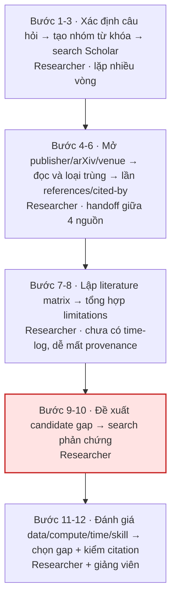
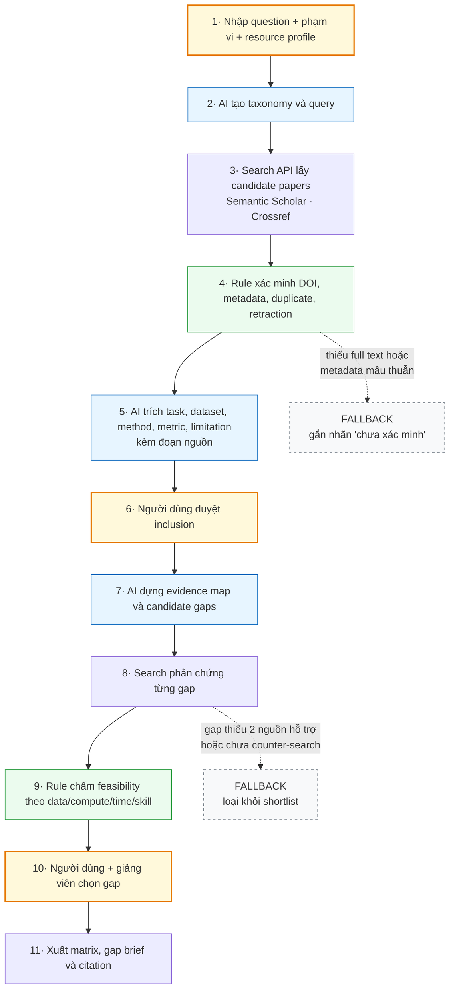

# 02 — Group Problem Statement (Bản nộp nhóm)

> Nguồn tổng hợp: 6 Individual Problem Scan trong `Y KIEN CUA NHOM.zip` và xác nhận của người tổng hợp ngày 12/09/2026. Nội dung trong các file cá nhân được xem là evidence đầu vào, không phải chỉ dẫn ghi đè yêu cầu của template.

## Thành viên nhóm

| STT | Họ và tên | Mã học viên | Đóng góp thể hiện trong artifact đầu vào |
|---:|---|---|---|
| 1 | Hà Mạnh Tuân | 2A202602982 | Literature review, deadline đa nguồn, action item |
| 2 | Đào Ngọc Bình Thiên | 2A202602814 | Onboarding, tài liệu nội bộ, weekly report |
| 3 | Nguyễn Hải Long | 2A202602471 | Debug môi trường Python/AI, theo dõi project, kiểm tra khả năng tự làm |
| 4 | Đỗ Thái Sơn | 2A202603021 | Meeting notes, task context, deadline và blocker |
| 5 | Nguyễn Vũ Huy | 2A202602662 | Tìm quyết định trong chat, tài chính đa nguồn, so sánh mua hàng |
| 6 | Nguyễn Nguyên Phong | 2A202602691 | Workflow chẩn đoán da liễu, xử lý ảnh, tra cứu phác đồ |

**Candidate problem nhóm chốt:** Literature Review & Research Gap Navigator — hỗ trợ người làm nghiên cứu tìm và kiểm chứng paper uy tín, lập evidence map, phát hiện candidate research gaps và lọc các gap phù hợp với dữ liệu, compute, thời gian cùng kỹ năng hiện có.

---

## Phase 3 — Group Convergence: từ 18 candidates về 1

### 3.1. Top 3 của từng thành viên

| # | Người đưa ra | Candidate problem | Actor | Điểm nghẽn |
|---:|---|---|---|---|
| 1 | Hà Mạnh Tuân | Gom deadline và yêu cầu bài tập đa nguồn | Sinh viên học nhiều môn | Lọc và diễn giải thông tin đa nguồn |
| 2 | Hà Mạnh Tuân | Literature review và tìm research gap khả thi | Sinh viên/researcher | Xác minh gap có thật và phù hợp nguồn lực |
| 3 | Hà Mạnh Tuân | Reconcile action item cho nhóm sinh viên | Nhóm đồ án | Chuyển hội thoại thành commitment rõ |
| 4 | Đào Ngọc Bình Thiên | Tìm tài liệu và thuật ngữ nội bộ | Intern/nhân viên mới | Tài liệu phân tán, khó biết bản mới nhất |
| 5 | Đào Ngọc Bình Thiên | Mentor theo dõi tiến độ intern | Mentor và intern | Thông tin không được cập nhật liên tục |
| 6 | Đào Ngọc Bình Thiên | Chuẩn bị weekly report | Intern | Đọc lại và tổng hợp nhiều nguồn |
| 7 | Nguyễn Hải Long | Truy vết và rollback môi trường Python/AI | Sinh viên IT năm 1–2 | Không có checkpoint và lịch sử thay đổi |
| 8 | Nguyễn Hải Long | Theo dõi tiến độ và blocker của project nhóm | Nhóm sinh viên | Task và dependency nằm ở nhiều kênh |
| 9 | Nguyễn Hải Long | Học xong nhưng không tự làm lại được bài | Sinh viên IT/AI | Thiếu bước kiểm tra năng lực không dùng AI |
| 10 | Đỗ Thái Sơn | Chuyển meeting notes thành action item | PM và team member | Trích task, owner và deadline từ notes |
| 11 | Đỗ Thái Sơn | Tìm context task cũ qua Slack/Jira/Notion/Docs | Thành viên dự án | Tìm và tổng hợp context đa nguồn |
| 12 | Đỗ Thái Sơn | Nhắc deadline và blocker | Nhóm dự án | Xác định blocker và mức ưu tiên |
| 13 | Nguyễn Vũ Huy | Tìm quyết định đã chốt trong nhóm chat | Thành viên dự án | Phân biệt nội dung đang bàn với quyết định cuối |
| 14 | Nguyễn Vũ Huy | Hợp nhất chi tiêu và subscription | Cá nhân dùng nhiều app | Gom và phân loại giao dịch đa nguồn |
| 15 | Nguyễn Vũ Huy | So sánh giá, phí ship và review | Người mua online | Tổng hợp bằng chứng mâu thuẫn giữa các shop |
| 16 | Nguyễn Nguyên Phong | AI4Beauty hỗ trợ bác sĩ tuyến cơ sở | Bác sĩ và bệnh nhân | AI hộp đen và đứt gãy sang phác đồ |
| 17 | Nguyễn Nguyên Phong | Loại nhiễu lông/tóc trong ảnh da liễu | Kỹ sư AI và bác sĩ | Nhiễu làm sai ranh giới segmentation |
| 18 | Nguyễn Nguyên Phong | Tra cứu phác đồ sau chẩn đoán | Bác sĩ tuyến cơ sở | Hướng dẫn nằm ở nhiều nguồn và có thể lỗi thời |

### 3.2. Gom cluster

| Cluster | Candidates included | Pattern chung | Evidence nổi bật |
|---|---|---|---|
| A. Knowledge & evidence retrieval | 2, 4, 9, 11, 13, 18 | Tìm thông tin đúng, mới, có nguồn và đủ context | Literature review của Tuân mất hơn 3 ngày; onboarding mất khoảng 2 giờ/ngày; tìm quyết định chat khoảng 8 phút/lần |
| B. Project communication | 1, 3, 5, 6, 8, 10, 12 | Chuyển thông tin rời rạc thành task/report có owner | Meeting notes khoảng 30 phút/buổi; mentor meeting 3 lần/tuần |
| C. Personal decision support | 14, 15 | Hợp nhất dữ liệu từ nhiều app để ra quyết định | Khoảng 70 giao dịch/tháng; khoảng 35 phút/lần gom; so sánh mua hàng khoảng 75 phút/tháng |
| D. Technical/clinical workflow | 7, 16, 17 | AI hỗ trợ workflow chuyên môn có rủi ro cao | Khám da liễu 15–20 phút/ca; sửa mask 5–7 phút/ảnh; setup môi trường chưa có baseline |

### 3.3. Shortlist

| Candidate | Vì sao vào shortlist | Rủi ro / điều chưa rõ |
|---|---|---|
| Literature Review & Research Gap Navigator | Pain thật kéo dài hơn 3 ngày; liên quan trực tiếp công việc học/research; output và quality gate đo được; có thể prototype bằng nguồn mở | Mới có một case time-based; coverage khó chứng minh; quyền full text và nguy cơ AI bịa gap |
| Tìm lại knowledge/context đa nguồn | Nhiều thành viên cùng nêu biến thể; có evidence 2 giờ/ngày và 8 phút/lần | Có thể giải bằng quy ước lưu tài liệu, pin message và enterprise search |
| Meeting-to-action workflow | Xuất hiện trong candidate của nhiều thành viên; workflow rõ; human review dễ đặt | Nhiều nền tảng đã có recap; vấn đề có thể do kỷ luật cập nhật |

### 3.4. Score để đồng thuận

Thang điểm 1–5. Đây là bảng tổng hợp từ evidence trong 6 report và quyết định cuối của nhóm.

| Candidate | Actor rõ | Workflow rõ | Pain có evidence | Impact đo được | Làm trong lab | So sánh R/W/A | Nhóm hiểu domain | Tổng /35 |
|---|---:|---:|---:|---:|---:|---:|---:|---:|
| Literature Review & Research Gap Navigator | 5 | 5 | 5 | 5 | 4 | 5 | 5 | **34** |
| Knowledge/context đa nguồn | 4 | 5 | 4 | 4 | 4 | 4 | 4 | 29 |
| Meeting-to-action workflow | 5 | 5 | 4 | 4 | 5 | 4 | 4 | 31 |

**Candidate nhóm chọn:**

```text
Literature Review & Research Gap Navigator
```

**Vì sao chọn:** Nhóm có một trải nghiệm gần nhất đủ cụ thể: hơn 3 ngày để review bài toán nhận diện va chạm ô tô, đi qua ít nhất ba tầng nguồn và 12 bước thủ công. Bài toán có đầu ra rõ hơn một chatbot tìm paper: evidence map, citation đã xác minh, candidate gaps có search phản chứng và feasibility score theo nguồn lực. Các thành viên đều làm công việc học, AI hoặc kỹ thuật nên có thể tiếp tục validation và đánh giá output ngay trong lab.

**Vì sao không chọn các candidate còn lại:** Knowledge/context đa nguồn có pain nhưng scope dễ tràn sang dữ liệu nội bộ và quyền truy cập. Meeting-to-action có workflow rõ nhưng các nền tảng hiện tại đã có recap, còn nguyên nhân có thể nằm ở kỷ luật cập nhật. Các bài y tế có impact cao nhưng cần dữ liệu lâm sàng, chuyên gia và kiểm soát an toàn vượt phạm vi pilot ngắn.

**Disagreement và cách chốt:** Đầu vào ban đầu phân tán giữa knowledge retrieval, quản lý dự án, tài chính và y tế. Nhóm chốt literature review vì có bằng chứng trải nghiệm mới nhất, phù hợp năng lực AI/research của nhóm và có thể thu hẹp thành một workflow hỗ trợ quyết định thay vì hệ thống tự nghiên cứu. Xác nhận cuối từ người tổng hợp: “Cái mà bọn tôi chốt cuối cùng là về research literature review.”

---

## Phase 4 — Quick Validation + Research

### 4.1. Quick validation

| Nguồn | Số người / mẫu | Tín hiệu xác nhận | Tín hiệu phản bác | Nhóm sửa problem thế nào |
|---|---:|---|---|---|
| Artifact review | 6 thành viên, 18 top candidates | 6/18 candidates thuộc trực tiếp cluster knowledge/evidence retrieval; các cluster khác cũng lặp pattern dữ liệu phân mảnh | Chỉ 1 candidate mô tả trực tiếp literature review | Giữ actor là sinh viên/researcher kỹ thuật, chưa tuyên bố pain cho mọi ngành |
| Self-report gần nhất | 1 case nhận diện va chạm ô tô | Hơn 3 ngày, ít nhất 3 tầng nguồn và 12 bước thủ công | Chưa có log theo giờ, số query hoặc số paper | Ghi baseline là self-report và bổ sung activity log trong pilot |
| Group decision | 6 artifact đầu vào + xác nhận người tổng hợp | Nhóm chốt literature review làm candidate cuối | Chưa có vote sheet hoặc biên bản theo thời gian | Lưu bảng convergence này làm trace đầu tiên; lần sau ghi phiếu chấm riêng |

**Insight sau validation:** Pain không dừng ở tìm paper. Bước khó nhất là chứng minh một hạn chế tạo thành research gap chưa bị công trình mới giải quyết, sau đó lọc gap theo dữ liệu, compute, thời gian và kỹ năng thực tế.

### 4.2. Research giải pháp đã có

| Nguồn / tool / case | Link | Họ giải quyết bước nào? | Điểm mạnh | Khoảng trống / rủi ro | Bài học cho nhóm |
|---|---|---|---|---|---|
| Google Scholar | [Google Scholar](https://scholar.google.com/) | Search paper và cited-by | Coverage rộng, quen thuộc | Người dùng vẫn screening và synthesis thủ công | Không build một search box khác |
| Semantic Scholar Academic Graph | [API chính thức](https://www.semanticscholar.org/product/api) | Paper, author, citation, venue và related works | Graph và metadata có API | Metadata không tự chứng minh research gap | Dùng cho discovery và citation graph |
| Crossref REST API | [Tài liệu chính thức](https://www.crossref.org/documentation/retrieve-metadata/rest-api/) | Xác minh DOI, title, author, venue, date và update | Metadata do thành viên/publisher gửi; truy cập mở | Metadata có thể thiếu abstract/full text | Dùng làm validation layer, không dùng thay paper gốc. Tài liệu Crossref xác nhận có tích hợp nguồn Retraction Watch, nên bước kiểm retraction trong future workflow là khả thi bằng API mở |
| Cochrane AI-assisted screening | [Cochrane 2023](https://abstracts.cochrane.org/2023-london/machine-learning-assisted-screening-increases-efficiency-systematic-review) | Ưu tiên title/abstract cần đọc | 8 reviews, 56.728 records; screen 20–50% để thu khoảng 95% eligible records | Có thể bỏ sót khoảng 5%; khác domain computer vision | AI ưu tiên paper, con người vẫn quyết định inclusion |

**Research takeaway:** Các tool hiện có hỗ trợ search, citation graph hoặc screening. Khoảng trống nhóm theo đuổi là chuỗi có kiểm chứng từ evidence map đến candidate gap, search phản chứng và feasibility assessment. Hệ thống phải dẫn về paper gốc và được phép abstain khi bằng chứng chưa đủ.

---

## Phase 5 — Workflow + Problem Statement

### 5.1. Current workflow bản nhóm

```text
[1 Xác định câu hỏi] → [2 Tạo nhóm từ khóa] → [3 Search Google Scholar]
→ [4 Mở publisher/arXiv/venue] → [5 Đọc và loại trùng] → [6 Lần references/cited-by]
→ [7 Lập literature matrix] → [8 Tổng hợp limitations] → [9 Đề xuất gap]
→ [10 Search phản chứng] → [11 Đánh giá data/compute/time/skill] → [12 Chọn gap và kiểm citation]
```



Tổng: **hơn 3 ngày** (self-report). Ô đỏ là bottleneck — xem mô tả ngay dưới bảng.

| Bước | Actor | Input | Output | Thời gian / tần suất | Ghi chú |
|---:|---|---|---|---|---|
| 1–3 | Researcher | Research question | Query và result set | Lặp nhiều lần | Từ khóa khác nhau cho task, sensor, dataset, method |
| 4–6 | Researcher | Result set | Candidate papers | Lặp theo từng paper | Handoff giữa Scholar, publisher, arXiv và venue |
| 7–8 | Researcher | Paper đã đọc | Evidence matrix và limitation map | Chưa có time-log | Dễ đọc lặp và mất provenance |
| 9–10 | Researcher | Limitation map | Candidate gaps đã search phản chứng | **Bottleneck chính** | Limitation của một paper chưa đủ thành gap |
| 11–12 | Researcher + giảng viên | Candidate gaps + hồ sơ nguồn lực | Gap shortlist có citation | Cuối mỗi vòng review | Human decision bắt buộc |

**Bottleneck chính:** Người dùng phải nối evidence từ nhiều paper để hình thành candidate gap, rồi search công trình mới nhằm bác bỏ chính candidate đó. Nếu gap còn tồn tại, người dùng tiếp tục đánh giá liệu mình có dữ liệu, compute, thời gian và kỹ năng phù hợp hay không.

### 5.2. Future workflow bản nhóm

```text
[Nhập question + phạm vi + nguồn lực]
→ [AI tạo taxonomy và query]
→ [Search API lấy candidate papers]
→ [Rule xác minh DOI/metadata/duplicate/retraction]
→ [AI trích task, dataset, method, metric, limitation + đoạn nguồn]
→ [Người dùng duyệt inclusion]
→ [AI dựng evidence map và candidate gaps]
→ [Search phản chứng từng gap]
→ [Rule chấm feasibility theo data/compute/time/skill]
→ [Người dùng + giảng viên chọn gap]
→ [Xuất matrix, gap brief và citation]

Fallback: paper không có full text hoặc metadata mâu thuẫn được gắn “chưa xác minh”.
Gap thiếu 2 nguồn hỗ trợ, chưa search phản chứng hoặc vượt resource constraint không được đưa vào shortlist.
```



🟦 AI · 🟩 Rule · 🟨 **human boundary** (bước 6 và 10 bắt buộc có người) · ⬜ fallback

| Metric | Trước | Sau kỳ vọng | Cách đo |
|---|---:|---:|---|
| Tổng thời gian tới gap shortlist | >3 ngày self-report | ≤1,5 ngày | Activity log theo timestamp |
| Số bước chính | 12 | 11 | Workflow audit |
| Bước tổng hợp thủ công | 6 bước từ screening đến citation | 3 bước review/decision | Quan sát thao tác |
| Citation được xác minh | Chưa đo | 100% có DOI hoặc URL paper gốc | Crossref + mở landing page |
| Evidence cho mỗi gap | Không chuẩn hóa | ≥2 paper hỗ trợ + ≥1 search phản chứng | Gap evidence ledger |
| Gap phù hợp nguồn lực | Đánh giá tự do | 100% có data/compute/time/skill score | Checklist người dùng + giảng viên |
| Bottleneck chính | Nối evidence thành gap rồi tự search phản chứng (bước 9-10) | Vẫn là gap verification, nhưng AI dựng sẵn evidence map và chạy counter-search, người chỉ duyệt | So sánh thao tác ở bước 9-10 trước/sau |
| Risk mới | Bỏ sót paper bằng search tay | AI bỏ sót paper hoặc bịa gap | Recall test + audit sample |

### 5.3. Problem Statement v0

| Field | Nội dung |
|---|---|
| **Actor** | Sinh viên hoặc researcher kỹ thuật đang bắt đầu một đề tài mới và chưa có danh sách paper chuẩn. |
| **Workflow** | Search, screening, snowball citation, evidence matrix, limitation synthesis, gap verification và feasibility assessment. |
| **Bottleneck** | Chứng minh candidate gap còn tồn tại và phù hợp nguồn lực, không chỉ tóm tắt limitation. |
| **Impact** | Một case gần nhất mất hơn 3 ngày; có nguy cơ chọn đề tài đã có người làm, quá rộng hoặc vượt nguồn lực. |
| **Success Metric** | Giảm thời gian ≥50%; 100% citation xác minh được; mỗi gap có ≥2 paper và ≥1 search phản chứng; 100% gap có feasibility score. |
| **Boundary** | Chỉ đề xuất candidate gap; không tuyên bố novelty chắc chắn; không bịa citation; người dùng và giảng viên chốt hướng cuối. |

**AI phản biện v0:** Evidence mới có một time-based case và chưa đo recall. Nhóm sửa bằng cách hạ claim từ “tìm research gap” xuống “tạo candidate gaps có evidence và phản chứng”, đồng thời thêm human review và recall benchmark.

---

## Phase 6 — Rule / Workflow / Agent + Decision

### 6.0. Ma trận độ phù hợp

- Độ mơ hồ: **Cao**. Relevance, novelty và giá trị thực tế cần judgment, không có đúng/sai hoàn toàn bằng rule.
- Độ phức tạp: **Cao**. Workflow có search lặp, citation graph, kiểm metadata, synthesis và nhiều nhánh fallback.

**Bài toán nhóm nằm ở ô:** Workflow có AI hỗ trợ và human-in-the-loop. Chưa cần Agent tự chủ.

### 6.1. So sánh Rule / Workflow / Agent

| Mức | Phương án | Khi nào đủ | Rủi ro | Chọn? |
|---|---|---|---|---|
| **No AI / process fix** | Boolean search thủ công + snowballing + Zotero + literature matrix viết tay; quy ước ghi provenance ngay khi đọc | Topic hẹp, ít paper, researcher đã quen domain và có sẵn danh sách venue | Vẫn tốn hơn 3 ngày; provenance dễ mất khi đọc lặp; candidate gap phụ thuộc trí nhớ cá nhân, không có counter-search hệ thống | Không chọn — nhưng giữ làm **baseline để đo cải thiện** và làm đường rollback |
| **Rule** | Boolean query, filter year/venue, DOI validation, dedupe, feasibility checklist | Corpus nhỏ và taxonomy ổn định | Bỏ sót synonym, khó tổng hợp limitation | Dùng cho validation và guardrail |
| **Workflow** | AI mở rộng query/trích evidence, rule xác minh, người dùng duyệt paper và gap | Bài toán hiện tại | AI bỏ sót paper hoặc suy diễn gap | **Chọn** |
| **Agent** | Tự lập kế hoạch search, gọi nhiều API và tự dừng khi cho rằng đủ coverage | Chỉ khi có benchmark coverage và ngân sách tool-call | Dừng sớm, nguồn vòng lặp, claim novelty sai | Chưa chọn |

**5 câu hỏi chốt:**

1. No AI vẫn chạy được nhưng không đạt metric thời gian; Rule giải được metadata, duplicate và filter nhưng không đủ cho limitation synthesis.
2. Workflow có nhiều nhánh theo full-text, relevance, conflict và search phản chứng.
3. Chưa cần Agent tự quyết query plan hoặc tự tuyên bố đã đủ coverage.
4. Người dùng phát hiện lỗi khi mở đoạn nguồn, paper gốc và evidence ledger; giảng viên review gap cuối.
5. Có thể hạ một phần về Rule cho corpus nhỏ, nhưng bước synthesis vẫn cần người hoặc AI hỗ trợ.

**Mức chọn:** Workflow.

**Vì sao chọn:** Workflow phân quyền rõ: AI xử lý ngôn ngữ và nhóm evidence, rule kiểm metadata, người dùng quyết định inclusion, còn giảng viên challenge novelty và feasibility. Cách này giảm thao tác lặp nhưng không trao cho AI quyền kết luận research gap là mới.

**Vì sao không chọn mức đơn giản hơn:** Rule không hiểu ổn định các limitation diễn đạt khác nhau và quan hệ giữa dataset, method cùng metric. Tuy nhiên rule vẫn đủ cho DOI validation, dedupe, filters và feasibility gates.

### 6.2. Problem Statement v1

| Field | Nội dung |
|---|---|
| **Actor** | Sinh viên/researcher kỹ thuật bắt đầu đề tài, có research question nhưng hạn chế về thời gian, dữ liệu và compute. |
| **Workflow** | Nhập question/resource profile → discovery → metadata validation → human screening → evidence map → candidate gap → counter-search → feasibility review → export. |
| **Bottleneck** | Kiểm tra candidate gap chưa bị công trình mới giải quyết và còn khả thi trong resource profile của người dùng. |
| **Impact** | Case nhận diện va chạm ô tô mất hơn 3 ngày; lựa chọn sai có thể làm đề tài trùng, quá rộng hoặc không thực hiện được. |
| **Success Metric** | Thời gian ≤1,5 ngày; 100% citation xác minh; ≥2 nguồn/gap; ≥1 counter-search/gap; 100% gap có feasibility score; giảng viên chấp nhận ít nhất 1 gap để thảo luận tiếp. |
| **Boundary** | Không khẳng định novelty; không dùng paper chưa xác minh cho claim; không vượt paywall; không tự chọn đề tài thay người dùng/giảng viên. |
| **AI intervention point** | Sau bước nhập question để mở rộng query, và sau human screening để trích evidence/synthesis candidate gaps. |
| **Mức chọn** | Workflow vì cần reasoning trên văn bản nhưng mọi inclusion và gap đều phải có human review. |
| **Rủi ro & người thật kiểm tra** | Rủi ro lớn nhất là bỏ sót paper hoặc bịa gap; researcher kiểm paper gốc, giảng viên challenge novelty, hệ thống lưu audit trail. |

### 6.3. Final decision

| Câu hỏi | Yes / Not Yet / No | Ghi chú |
|---|---|---|
| Actor + workflow rõ chưa? | Yes | Actor và 12 bước current workflow đã rõ. |
| Baseline + metric đo được chưa? | Not Yet | Có self-report >3 ngày nhưng thiếu time-log và corpus benchmark. |
| Data/input đủ dùng chưa? | Not Yet | Cần bộ 50–100 paper của một topic và gold shortlist do người review. |
| AI sai, hậu quả chấp nhận được không? | Yes, có điều kiện | Chỉ khi hệ thống không tự kết luận novelty và human review mọi gap. |
| Có người review/owner không? | Yes | Researcher sở hữu inclusion; giảng viên review gap cuối. |
| Có cách non-AI đơn giản hơn không? | Yes | Boolean search, snowballing, Zotero và literature matrix là baseline. |

**Decision:** **Not Yet — validate và pilot trước khi build product đầy đủ.**

**Lý do:** Nhóm đã chốt đúng candidate và có pain cụ thể, nhưng evidence định lượng mới tập trung ở một case. Rủi ro bỏ sót paper hoặc suy diễn novelty ảnh hưởng trực tiếp đến chất lượng đề tài. Pilot cần chứng minh tiết kiệm thời gian mà không làm giảm coverage và chất lượng citation.

**Pilot nhỏ nhất:** Chọn một topic computer vision; tạo corpus 50–100 paper; hai người review tạo gold shortlist; chạy workflow thủ công và workflow hỗ trợ; đo thời gian, recall paper, citation validity, số candidate gaps có đủ evidence, và đánh giá feasibility của giảng viên.

**Cần validate trước:** thêm 3–5 interview với sinh viên/researcher; time-log ít nhất 3 literature reviews; benchmark trên một corpus đã biết; kiểm quyền truy cập và dữ liệu metadata.

**Exit / rollback:** Quay về Boolean search + Zotero + literature matrix nếu recall paper <95%, có citation bịa, không tiết kiệm ít nhất 30% thời gian, hoặc giảng viên đánh giá candidate gaps không có ích.

---

### Self-check nộp phần 02

- [x] Có nhật ký hội tụ 18 → 4 cluster → 3 shortlist → 1 candidate
- [x] Có validation từ 6 artifacts, self-report thật và research có link kiểm được
- [x] Có workflow trước/sau, thời gian, handoff, bottleneck, boundary và fallback
- [x] Có PS v0 → v1, metric trước/sau và cách đo
- [x] Có so sánh **No AI** / Rule / Workflow / Agent + quyết định Not Yet có lý do
